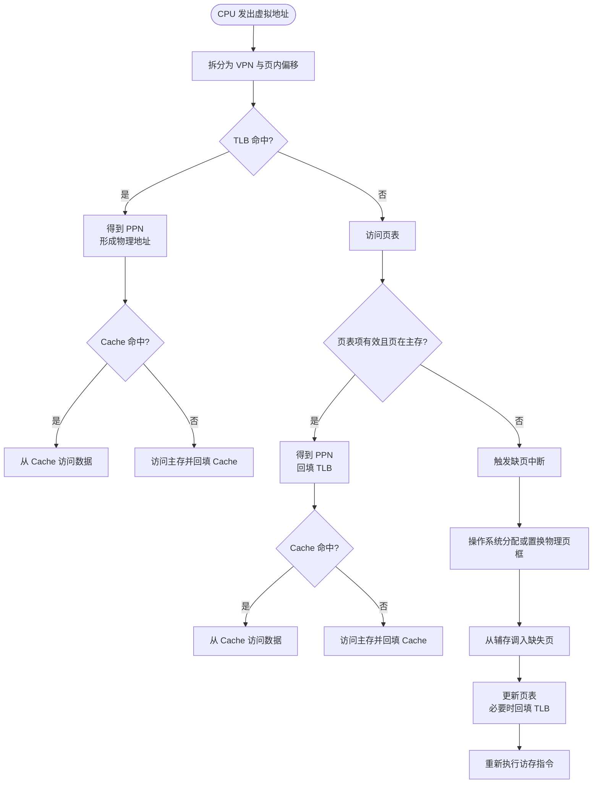

# 虚拟存储器

计算机通过虚拟地址为进程提供连续、独立的地址空间，并由硬件与操作系统协作完成虚拟地址到物理地址的转换。虚拟存储器还提供了地址保护、内存共享和按需调页等机制；通常虚拟地址空间可以远大于实际物理内存空间。

虚拟地址访问的大致通路为：

```text
CPU - 虚拟地址 - 地址转换(MMU/TLB/页表) - 物理地址 - Cache - 主存
                                                   |
                                                缺页中断
                                                   |
                                                  辅存
```
## 页式虚拟存储器

页式虚拟存储器以页为基本单位管理地址空间。虚拟地址通常被拆分为虚页号(VPN)和页内偏移，页表将虚页号映射到物理页框号(PPN)，页内偏移在转换前后保持不变。

页表通常存放在主存中。为了避免每次访存都访问页表，处理器使用快表(TLB)缓存最近使用过的页表项。TLB不是另一张独立页表，而是页表项的高速缓存，常采用全相联或组相联结构；查找时通常用虚页号(VPN)以及地址空间标识(ASID)等信息匹配，命中后直接得到物理页框号(PPN)。

页式虚拟存储器的访存逻辑为:


页表项和TLB项中通常会包含有效位、访问权限位、引用位和脏位等控制信息。脏位表示该页在主存中的副本是否被修改过：当发生页面置换时，如果被换出的页是脏页，就需要写回辅存；如果不是脏页，可以直接丢弃主存中的副本。

缺页发生在页表项无效，或者页表项表明目标页当前不在主存时。此时由操作系统处理缺页中断：如果有空闲页框，就把缺失页从辅存调入该页框；如果没有空闲页框，就根据页面置换算法选择一个牺牲页。LRU是常见的页面置换思想之一，但实际系统也可能使用近似LRU、Clock等算法。

